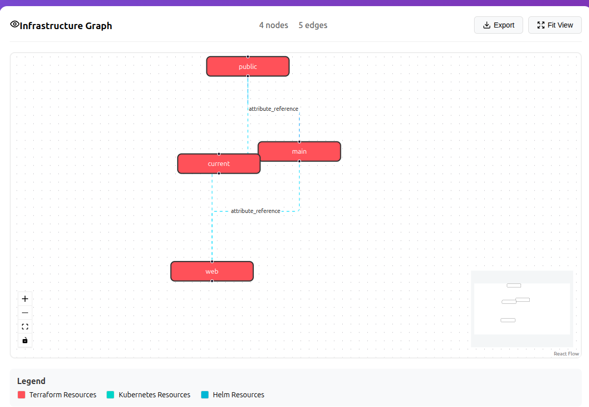
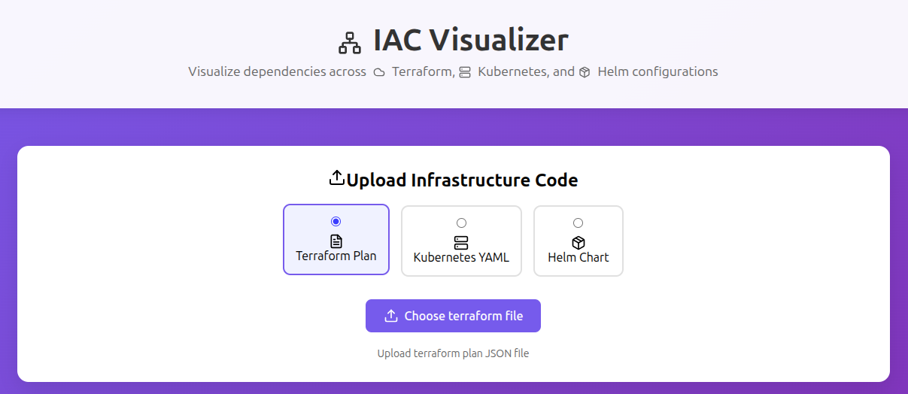

# 🏗️ IAC Visualizer

**Parse Terraform/Kubernetes/Helm and render an interactive, scalable dependency graph with impact analysis and drift hints.**

A comprehensive infrastructure-as-code visualization tool that automatically discovers dependencies and relationships across Terraform, Kubernetes, and Helm configurations with a modern React-based web interface.

[](https://github.com/Shaktijha163/iac-visualizer/blob/main/LICENSE)
[](https://github.com/Shaktijha163/iac-visualizer/stargazers)
[](https://github.com/Shaktijha163/iac-visualizer/network)

## 🌟 Features

### Backend Capabilities
- **Multi-Format Support**: Parse Terraform plans, Kubernetes manifests, and Helm charts
- **Dependency Discovery**: Automatically detect explicit and implicit relationships
- **Interactive API**: RESTful FastAPI endpoints for programmatic access
- **CLI Interface**: Command-line tool for local development
- **Graph Export**: Generate JSON graphs for visualization

### Frontend Features
- **Interactive Web UI**: Modern React-based interface for file uploads and visualization
- **Real-time Visualization**: Interactive dependency graphs using React Flow
- **Multi-format Upload**: Support for Terraform JSON, Kubernetes YAML, and Helm charts
- **Visual Feedback**: Color-coded nodes and edges for different resource types
- **Responsive Design**: Works seamlessly across desktop and mobile devices
- **Error Handling**: Comprehensive error display with detailed feedback

## 🎨 Web Interface

The web application provides an intuitive interface for uploading and visualizing infrastructure code:

- **File Upload**: Simple drag-and-drop or click-to-upload interface
- **Format Selection**: Choose between Terraform, Kubernetes, or Helm formats
- **Interactive Graph**: Zoom, pan, and explore your infrastructure dependencies
- **Legend**: Color-coded legend to understand different resource types
- **Export Options**: Download graphs for documentation or sharing


## Screenshot




## 📁 Project Structure

```
iac-visualizer/
├── frontend/                # React web application
│   ├── src/
│   │   ├── components/      # React components
│   │   │   ├── FileUpload.js    # File upload component
│   │   │   ├── GraphVisualizer.js # Graph visualization
│   │   │   └── Header.js        # Application header
│   │   ├── hooks/           # Custom React hooks
│   │   ├── utils/           # Utility functions
│   │   ├── App.js           # Main application component
│   │   └── index.js         # Application entry point
│   ├── public/              # Static assets
│   └── package.json         # Frontend dependencies
├── cli/                     # Command-line interface
├── server/                  # FastAPI web server
├── parsers/                 # Infrastructure parsing engines
│   ├── terraform/           # Terraform plan parser
│   ├── kubernetes/          # Kubernetes YAML parser  
│   └── helm/                # Helm chart parser
├── graph/                   # Graph data models
├── examples/                # Sample infrastructure files
│   ├── terraform/           # Terraform examples
│   ├── kubernetes/          # Kubernetes examples
│   └── helm/                # Helm chart examples
├── tests/                   # Test suite
└── requirements.txt         # Python dependencies
```

## 🚀 Installation & Setup

### Prerequisites
- Python 3.8+
- Node.js 14+
- npm or yarn
- Helm CLI (for Helm chart parsing)

### Backend Setup

```bash
# Clone the repository
git clone https://github.com/Shaktijha163/iac-visualizer.git
cd iac-visualizer

# Create virtual environment (recommended)
python -m venv env
source env/bin/activate  # On Windows: env\Scripts\activate

# Install Python dependencies
pip install -r requirements.txt

# Install Helm CLI (required for Helm parsing)
curl https://raw.githubusercontent.com/helm/helm/main/scripts/get-helm-3 | bash
```

### Frontend Setup

```bash
# Navigate to frontend directory
cd frontend

# Install dependencies
npm install

# Start development server
npm start
```

The web application will be available at `http://localhost:3000`

### Start Backend Server

```bash
# From the project root directory
python -m server.app
```

The API server will be available at `http://localhost:8000`

## 🖥️ Usage

### Web Interface

1. **Access the Application**: Open `http://localhost:3000` in your browser
2. **Select Format**: Choose between Terraform, Kubernetes, or Helm
3. **Upload Files**:
   - **Terraform**: Upload `.json` plan files
   - **Kubernetes**: Upload `.yaml` or `.yml` manifest files
   - **Helm**: Upload `.tgz` chart files and optional values files
4. **Visualize**: View the interactive dependency graph
5. **Explore**: Use zoom, pan, and hover features to explore relationships

### Supported File Formats

| Infrastructure Type | Supported Files | Example |
|-------------------|----------------|---------|
| **Terraform** | JSON plan files | `terraform show -json plan.out > plan.json` |
| **Kubernetes** | YAML manifests | `deployment.yaml`, `service.yaml`, `ingress.yaml` |
| **Helm** | Packaged charts + values | `chart.tgz` + `values.yaml` |

### Command Line Interface (CLI)

```bash
# Parse Terraform plan
python cli/main.py ingest examples/terraform/complex.plan.json --type terraform

# Parse Kubernetes manifests
python cli/main.py ingest examples/kubernetes/deployment.yaml --type kubernetes

# Parse Helm chart
python cli/main.py ingest examples/helm/web-app-0.1.0.tgz --type helm

# Parse with custom output file
python cli/main.py ingest plan.json --type terraform --out custom-graph.json

# Use server API instead of local parsing
python cli/main.py ingest plan.json --type terraform --server http://localhost:8000
```

### Web Server API

```bash
# API endpoints:
curl -X POST -F "file=@plan.json" http://localhost:8000/api/parse/terraform
curl -X POST -F "files=@deployment.yaml" http://localhost:8000/api/parse/kubernetes
curl -X POST -F "chart=@chart.tgz" -F "values_files=@values.yaml" http://localhost:8000/api/parse/helm

# Get health status
curl http://localhost:8000/health

# Get example files
curl http://localhost:8000/api/examples/terraform
curl http://localhost:8000/api/examples/kubernetes
curl http://localhost:8000/api/examples/helm
```

## 📊 Example Usage

### Test with Provided Examples

```bash
# Terraform - AWS infrastructure
python cli/main.py ingest examples/terraform/complex.plan.json --type terraform

# Kubernetes - Microservices deployment
python cli/main.py ingest examples/kubernetes/deployment.yaml --type kubernetes

# Helm - Web application chart
python cli/main.py ingest examples/helm/web-app-0.1.0.tgz --type helm

# Multiple Kubernetes files
python cli/main.py ingest "examples/kubernetes/*.yaml" --type kubernetes
```

### Web Interface Examples

1. **Terraform Visualization**: Upload a Terraform JSON plan to see resource dependencies
2. **Kubernetes Cluster**: Upload multiple YAML files to visualize service relationships
3. **Helm Charts**: Upload packaged charts to understand template dependencies

## 🎯 Graph Output Format

The tool generates JSON graphs with the following structure:

```json
{
  "nodes": [
    {
      "id": "resource_id",
      "name": "Resource Name",
      "type": "resource_type",
      "attributes": {...},
      "namespace": "default"
    }
  ],
  "edges": [
    {
      "from_id": "source_resource",
      "to_id": "target_resource",
      "reason": "dependency_reason"
    }
  ]
}
```

## 🔧 Development

### Frontend Development

```bash
cd frontend
npm start          # Start development server
npm run build      # Build for production
npm test          # Run tests
```

### Backend Development

```bash
# Install development dependencies
pip install -r requirements-dev.txt

# Run tests
python -m pytest tests/

# Start server with auto-reload
uvicorn server.app:app --reload
```

### Adding New Parsers

1. Create parser in `parsers/your_format/`
2. Implement the required interface
3. Add API endpoint in `server/app.py`
4. Update frontend file upload component
5. Add tests and examples

## 🤝 Contributing

1. Fork the repository
2. Create your feature branch (`git checkout -b feature/amazing-feature`)
3. Commit your changes (`git commit -m 'Add some amazing feature'`)
4. Push to the branch (`git push origin feature/amazing-feature`)
5. Open a Pull Request

## 📝 License

This project is licensed under the MIT License - see the [LICENSE](LICENSE) file for details.

## 🐛 Troubleshooting

### Common Issues

1. **Backend Connection Error**: Ensure the backend server is running on `http://localhost:8000`
2. **File Upload Fails**: Check that you're uploading the correct file format for the selected type
3. **Graph Not Rendering**: Verify that the uploaded file contains valid infrastructure code
4. **Helm Charts Not Working**: Ensure you have Helm CLI installed and the chart is properly packaged

### Error Messages

- **"body.files: Field required"**: Use the correct endpoint for your file type
- **"Objects are not valid as a React child"**: This has been fixed in the latest version
- **"body.chart: Field required"**: Upload both chart and values files for Helm

## 🌟 Roadmap

- [ ] Support for AWS CDK
- [ ] Support for Azure ARM templates
- [ ] Real-time collaboration features
- [ ] Advanced graph analytics
- [ ] Export to various formats (PNG, SVG, PDF)
- [ ] Integration with CI/CD pipelines
- [ ] Docker containerization
- [ ] Cloud deployment guides

## 📞 Support

If you have any questions or issues, please:
1. Check the [Issues](https://github.com/Shaktijha163/iac-visualizer/issues) page
2. Create a new issue with detailed description
3. Join our community discussions

---

Made with ❤️ by [Shakti Jha](https://github.com/Shaktijha163)
